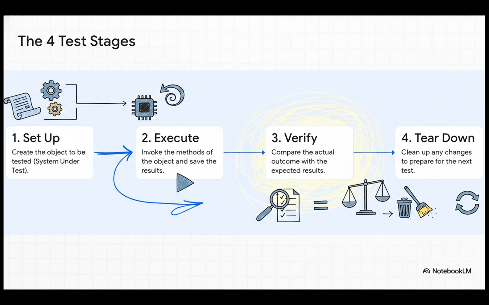
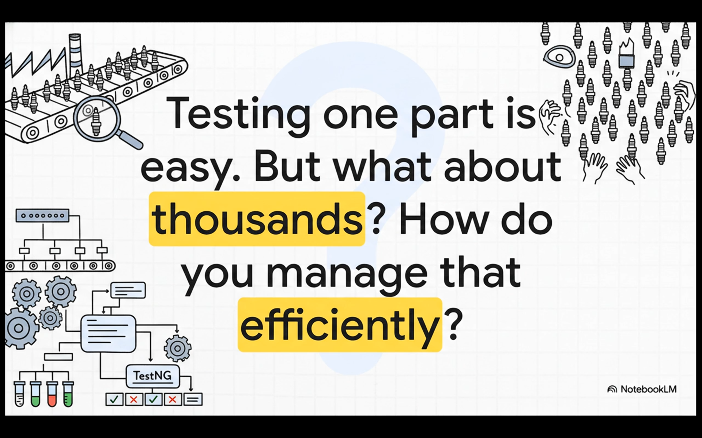
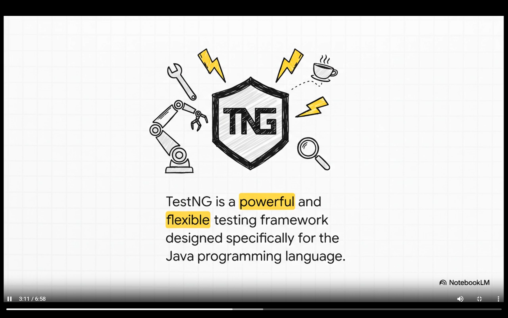
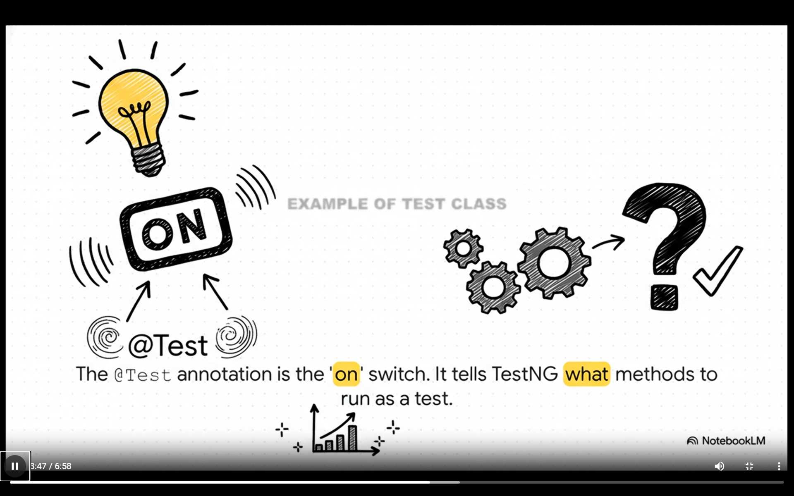
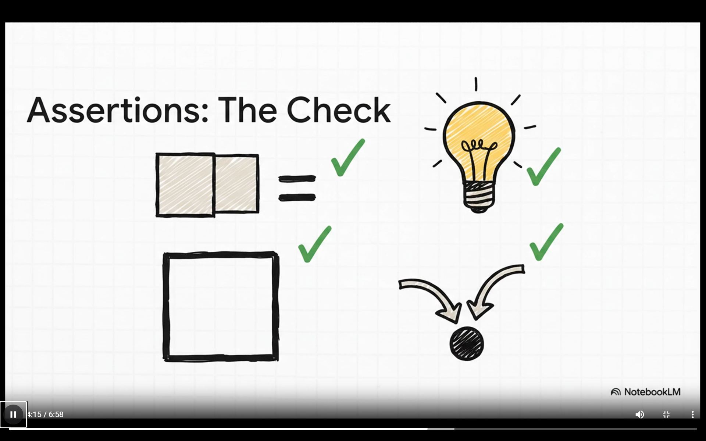
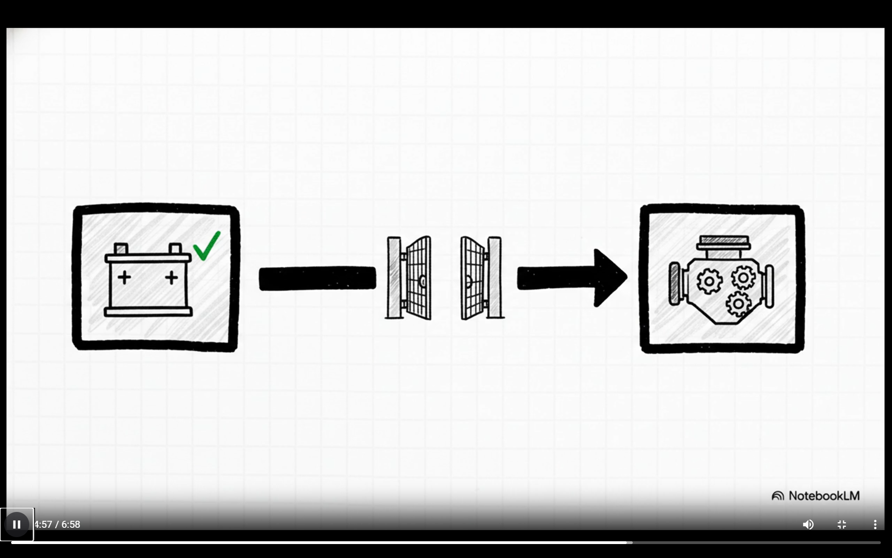

# TestNG - Test Next Generation

## Test Lifecycle

we are performing unit testing to make sure that its way easier to join and test the parts incrementally in integration testing, but in real life scenarios we generally have 10s and thousands of **unit test cases** in order to manage it, we use test framework

it provides us with the standard way to write and run test cases so that we can easily manage, and run the test cases, at the ends it gives us the summary of how test cases worked

## TestNG

Built Specifically for java programs

how do testNG identifies with method is a test to run?   
ans - it uses a `@Test` notation

## TestNG Functionalities

### Assertions

you tell testNG what you expect to happen, like i expect this function to return this value

### dependsOn Methods

let's you run the tests sequentially when a test depends upon the previous one

## Making tests usable
we can create different test cases for different user login but if we can create a single test and provide it details externally to run the same user tests.

### DataProviders

### Groups

when the projects become too large, then you can label your tests with something like `regression tests` so when you do have to run these sepecific test we can do it easily

## Why matters?

it automates and organizes the testing process and make

saves times, improves reliability and quality

## Test Unit vs Junit

### 1. Parallel Execution and Threading
TestNG provides **native support** for multi-threaded testing, making it easier to manage complex execution environments. It allows users to control parallel execution (e.g., by methods) via XML configuration,. In contrast, while JUnit 5 supports parallel execution, it is achieved primarily through configuration rather than being as deeply ingrained in the framework's native design.

### 2. Dependency Management and Execution Order
For complex test chains where specific methods must run before others, TestNG offers robust control mechanisms:
*   **Dependencies:** TestNG uses attributes like `dependsOnMethods` (and `dependsOnGroups`) to strictly control the execution order based on the success of previous methods,.
*   **Priorities:** It allows integers to define execution priority (lower numbers run first).

JUnit 5 controls execution order via `@Order` and `@TestMethodOrder`, but TestNG is specifically noted as being "better suited" for dependency testing,.

### 3. Parameterization
TestNG offers "more flexibility" for advanced parameterized tests compared to JUnit 5.
*   **TestNG:** Uses `@Parameters` (from XML) and `@DataProvider` annotations to inject complex data structures (returning `Object[][]`) directly into test methods,.
*   **JUnit 5:** Uses `@ParameterizedTest` and has a different approach to parameter injection, though TestNG's native support is described as "robust",.

### 4. Scope of Testing (Integration vs. Unit)
TestNG is designed as a **monolithic** framework intended to cover all categories of testing, including unit, functional, end-to-end, and integration testing,. This makes it a stronger fit for integration and functional testing scenarios. JUnit 5 features a **modular** design and is described as "ideal for unit testing," allowing developers to use only the specific modules they need,.

### 5. Configuration and Suites
*   **TestNG:** Relies heavily on **XML suite files** to configure test suites, enabling the grouping of classes, exclusion/inclusion of specific methods, and definition of parameters,. This is particularly useful for managing complex test suites with various configurations.
*   **JUnit 5:** Utilizes annotations like `@Suite` and `@SelectClasses` for test suite management.

### Summary Table: Complex Testing Features

| Feature | TestNG | JUnit 5 |
| :--- | :--- | :--- |
| **Complex Scenarios** | Better suited for parallel execution and dependency testing. | Ideal for modular unit testing. |
| **Parallel Execution** | Natively supported; easier to manage,. | Supported through configuration. |
| **Dependencies** | Controlled via `dependsOnMethods` and `priority`. | Controlled via `@Order`. |
| **Dynamic Tests** | Limited support (uses data providers). | Supported via `@TestFactory`. |
| **Design** | Monolithic (covers Unit, Functional, E2E, Integration),. | Modular with an Extension Model,. |