# Notes from the Recorded Video

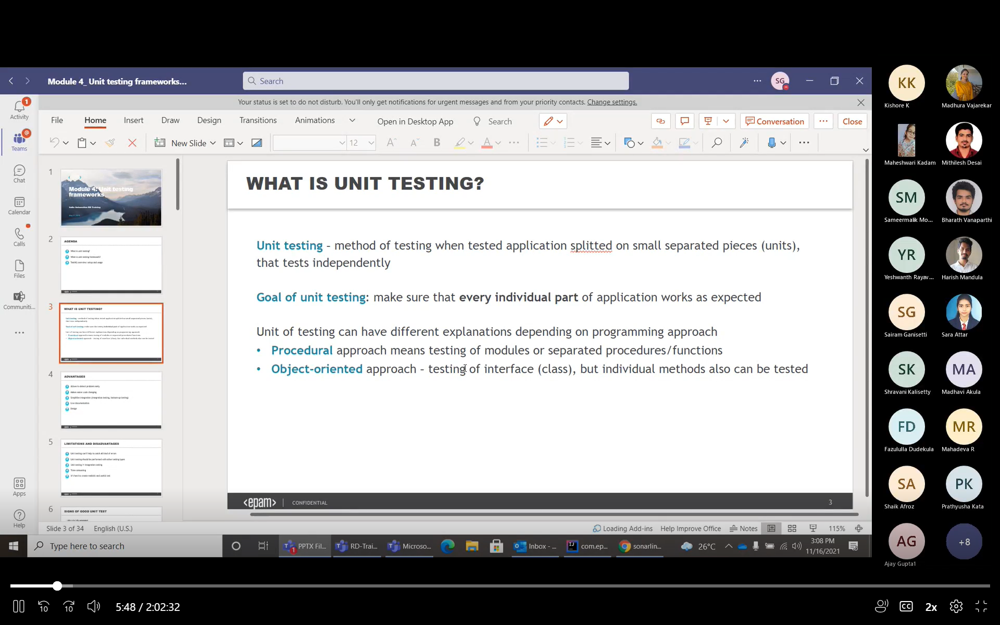

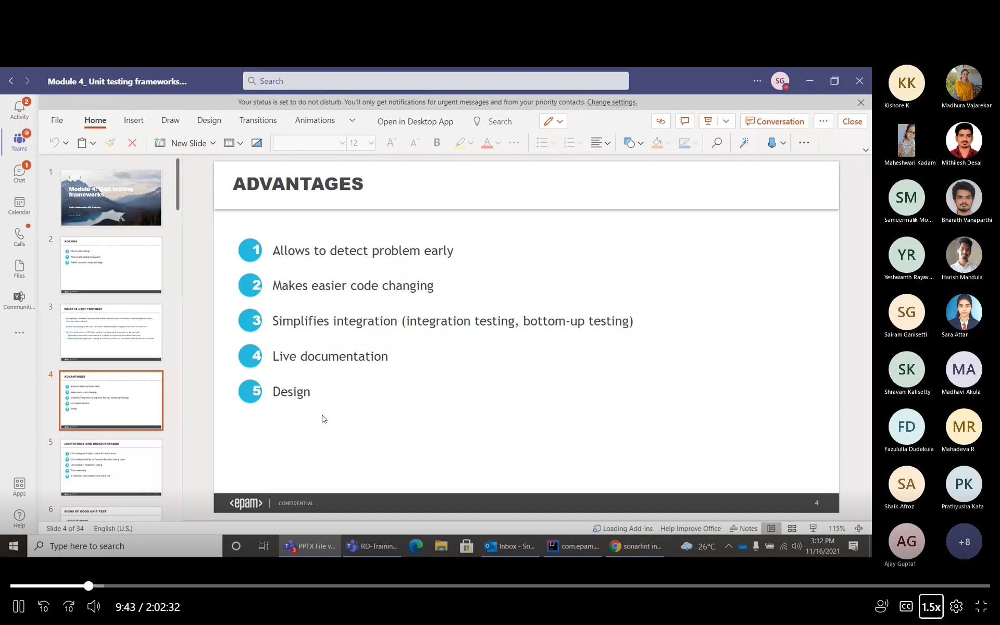
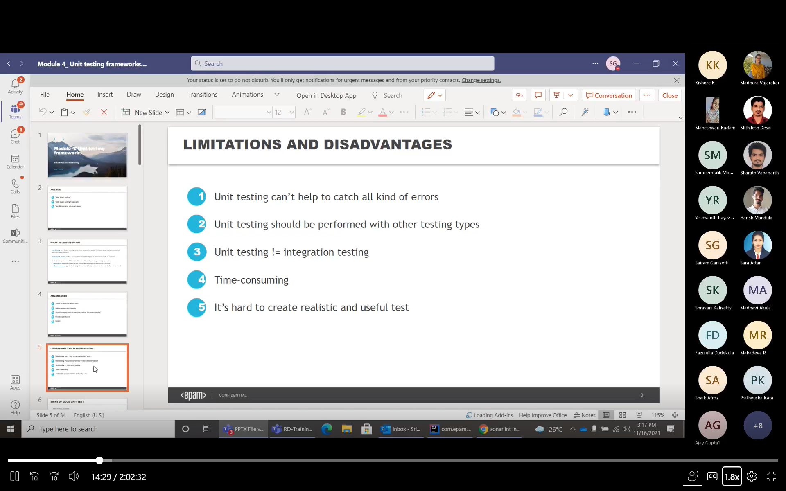

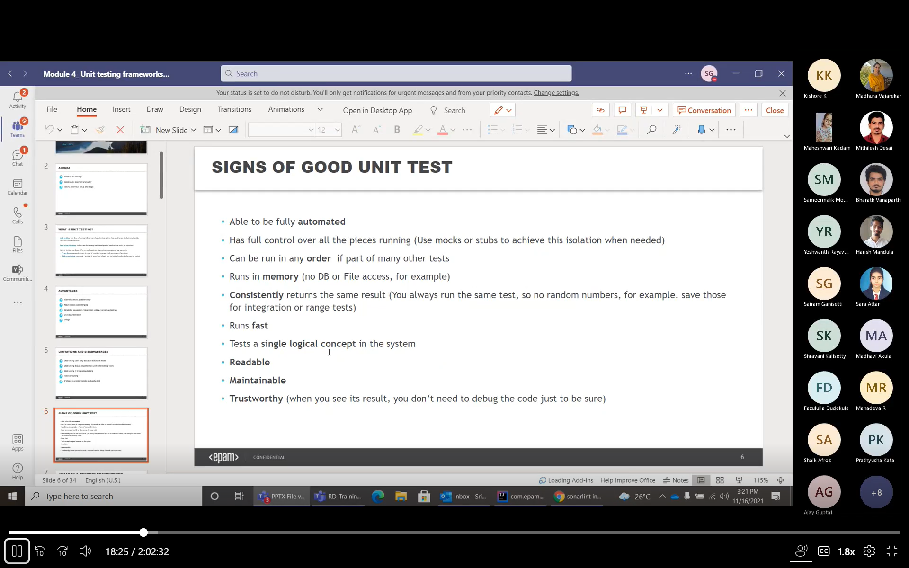

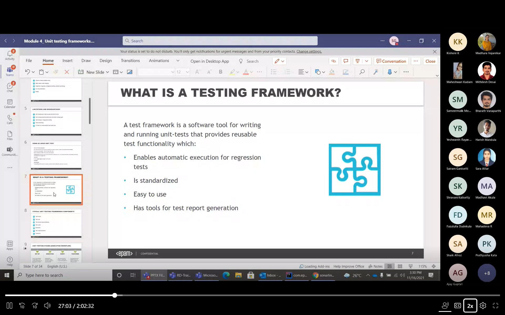

what is a framework?
> A framework is a set of tools, libraries, and best practices that provide a structured approach to work on a specific type of project. 

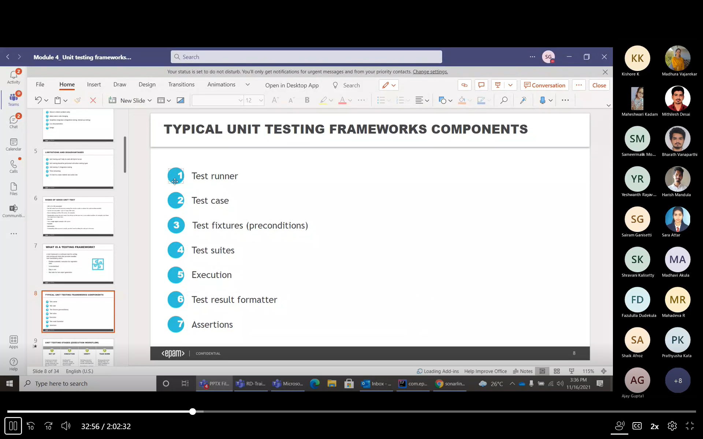
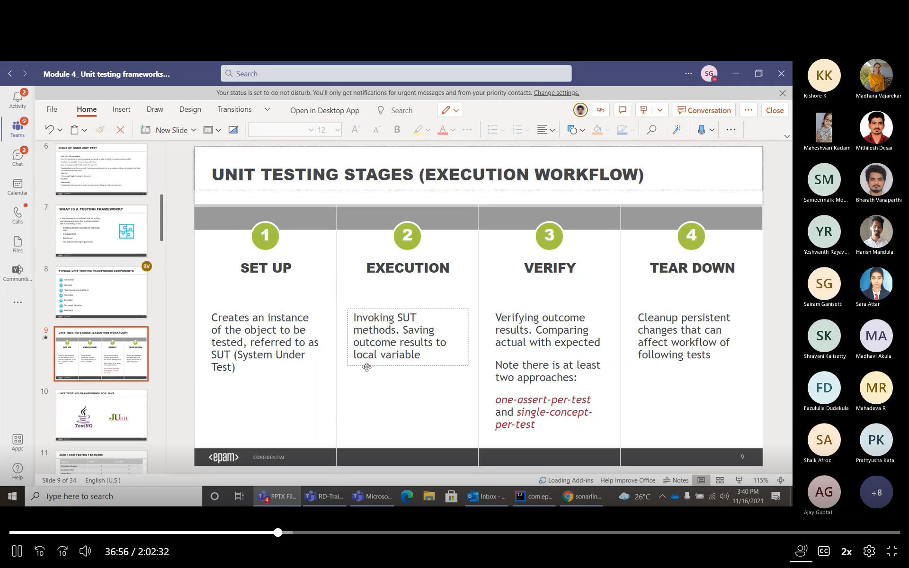
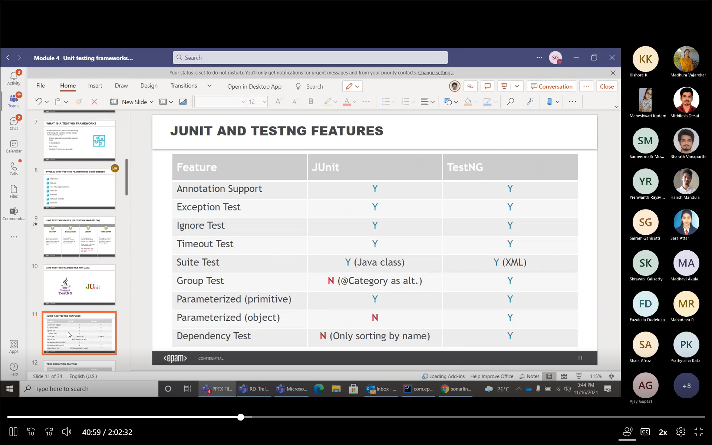
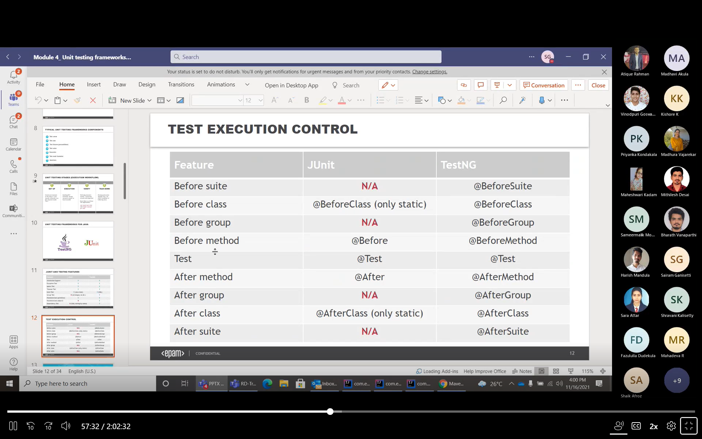

**by default the testng will execute the tests in alphabetical order**

**including and excluding the test case**

always run the test cases from the configuration file

technically we can have multiple assertion statements within a single test but it is not a best practice because then i will again need to explictly come to my code to check, what is failing and we won't be confident or sure about the test cases we wrote.

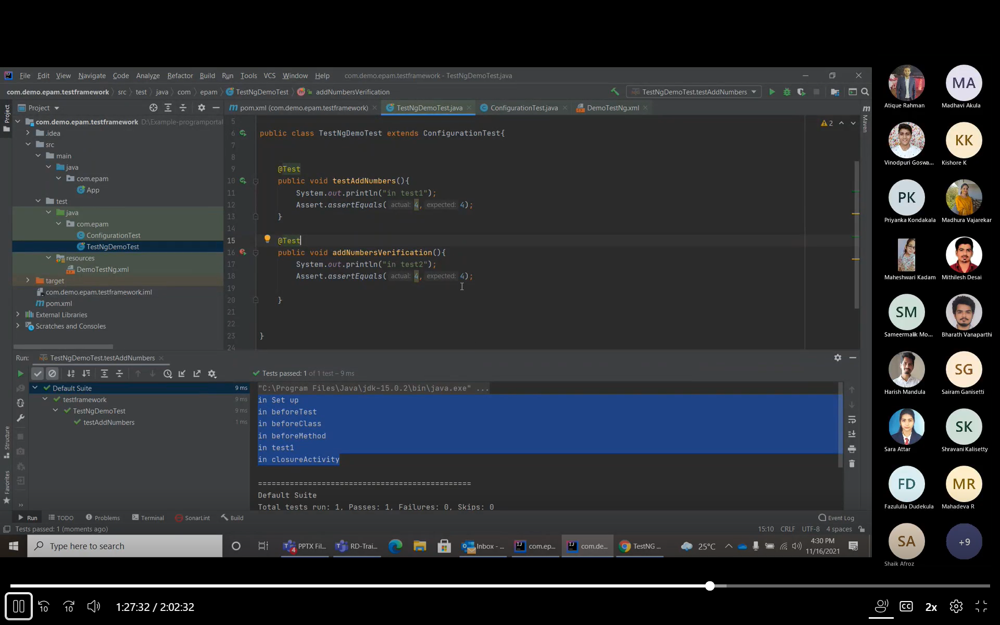

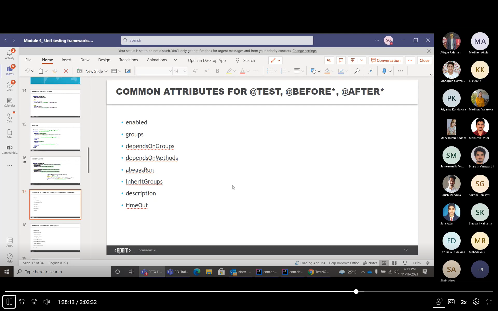

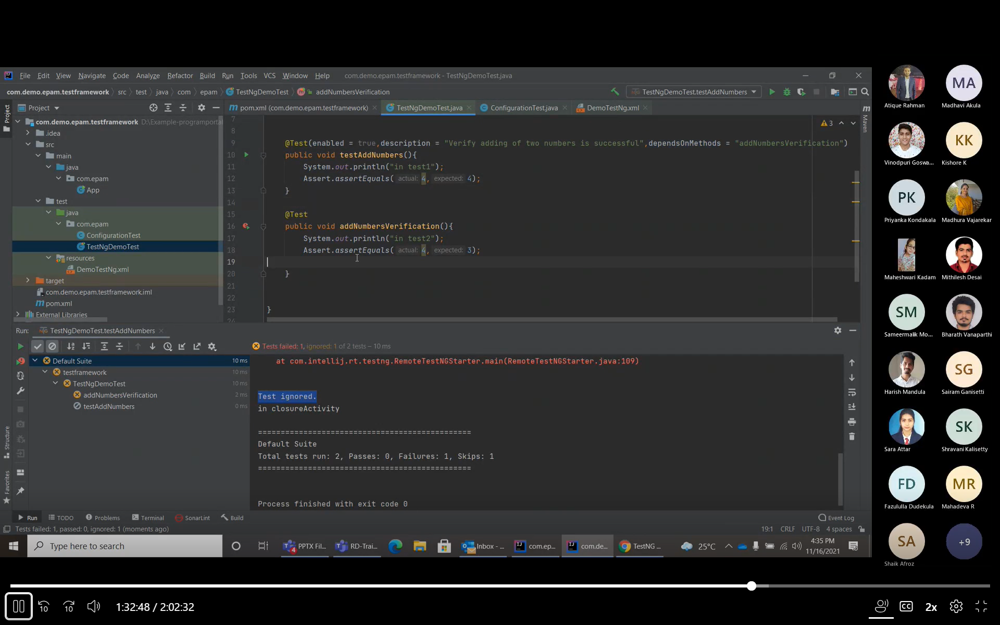

so if the depends upon method is enabled and the dependency fails our test case gets ignored but if we will have the attribute `alwaysRun = true` then it always will run irrespective of if dependency fails or not
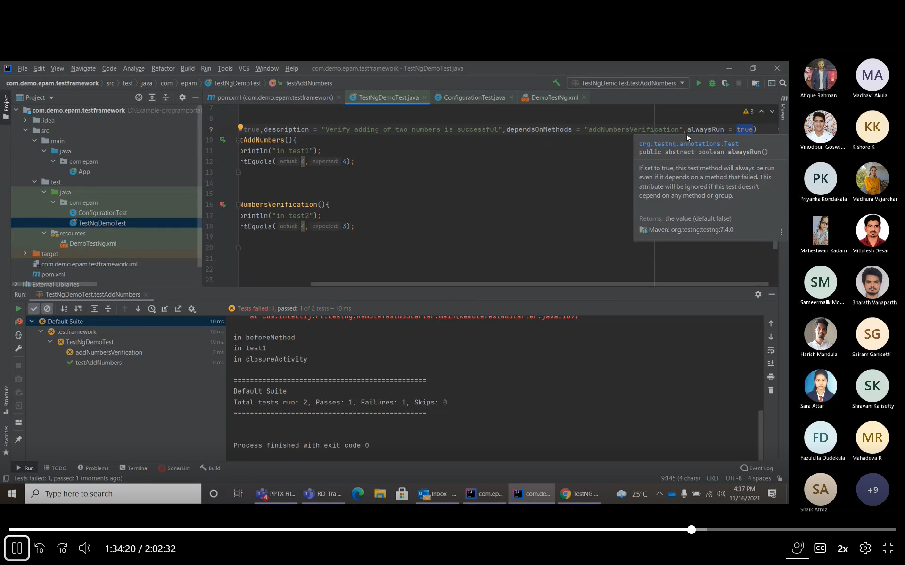

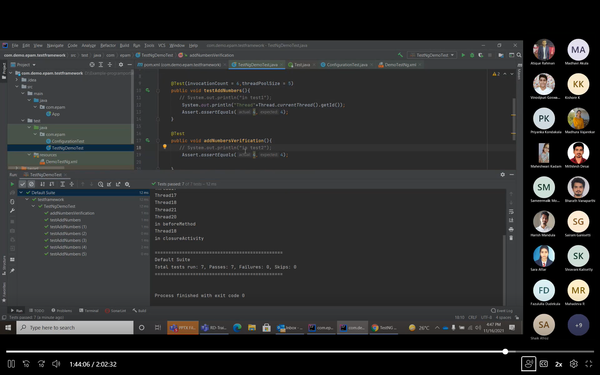

when you mention the invocation attribute this defines how many times do you need to invoke a particular method along with that we can also specify the theadpool size, then out program will use those number of parallel threads to process that function invocation in according to the number of invocations required
