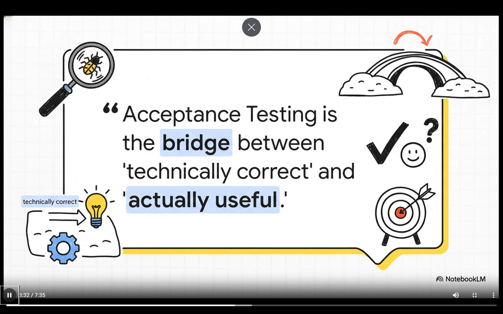
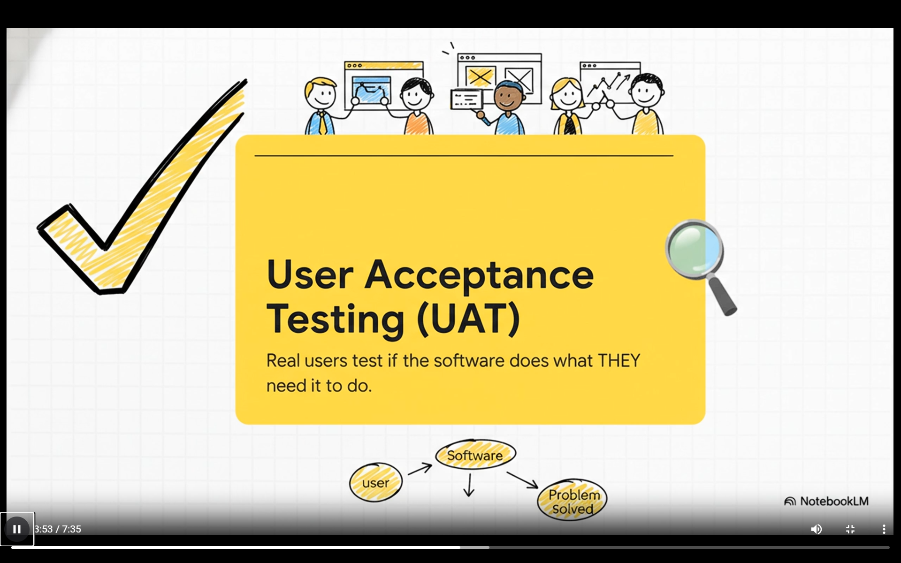
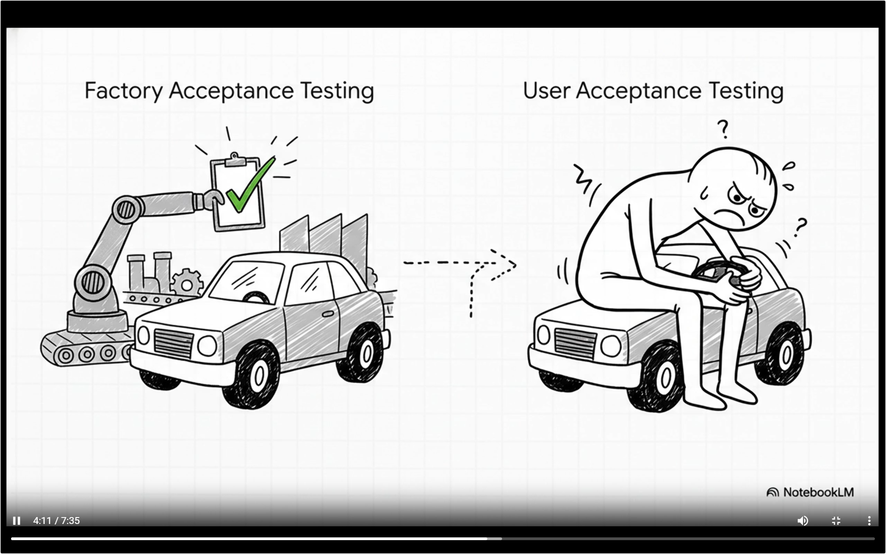
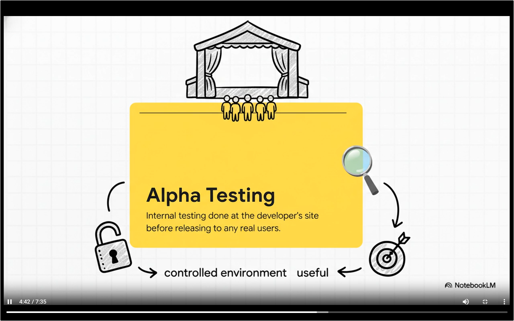
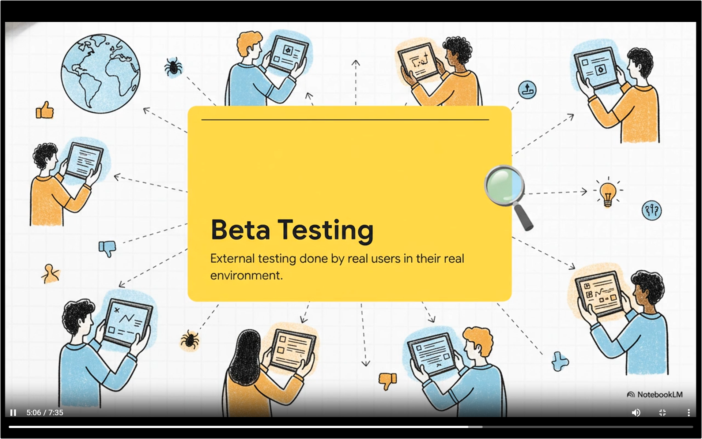
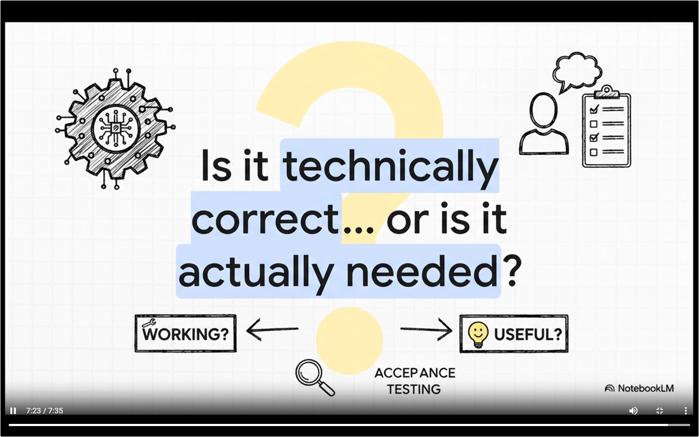

# Acceptance Testing

it asks the    **validation** question -> did we built the right system

A software might be technically correct but it correctly solves the user's core real issues that is not guranteed 

ex - hospital management system which was taking 47 clicks to admit the patients and the 2 min task became 15 min task; stuff disliked it.

because the real user didn't get to test it when it was under development; before it went live

user needs to test it

## how to get people involved in this

### Alpha Testing

you are finding any critical blockers (if any), the software is in the staging environment

example - a restaurant soft opening for staff only, real things but they are using the controlled environment

### Beta Testing

Here we provide the software in the hands of the **small selected group of real users** 

for restaurant ex - inviting some trusted food critiques before getting real customers

both of these tells us a different story since alpha testing is in controlled environment we might not catch few bugs like for an app maybe my testers are using new phone while when i ship it the customers are using older phones and we will discover few bugs there

## For Testers
while testing you must give them specific numeric criteria rather than a vague target like the screen must load within 2 secs

## Success Parameters of a software

success of the software depends upon the intersection of 3 circles

1. Technical Correctness 
2. User Experience - is it intuitive
3. Business Value - does this solves the problem efficiently

## User Acceptance Testing

The software built is tested by the real user, its like car is ready and the user says can i fit into it, can reach the pedals and all

it costs us money and expensive but its like a 100$ investment to save 100k$ in future because if the bug slips through the production it will cost us more

## Behaviour Driven Development (Driven my tool called CUCUMBER)

it provides us with a standard format to write the requirements; aims to reduce the communication gap between the BA and the developers to clearly gather the business requirements

like when you say like after the user logs in ......

there is a automation script that log in the user gets activated

usually QA lead writes it with the validation of BA

robert framework - keyword driven

## Traps
### Squeeze (biggest issues)
when we give very less time to UAT at the end, we need to stop treating it like something that happens at the end

for the features we are building we can include UAT in those sprints

### Vague Requirements 
like make it user friendly, make it measurable, you can say like a new user can complete the registration within 2 minutes without any external help

### Edge cases and non functional requirements
- how it works on low internet 
- emoji on zip code field
- double clicking the submit button in a transaction

UAT is the difference between the product that basically functions and a really good product