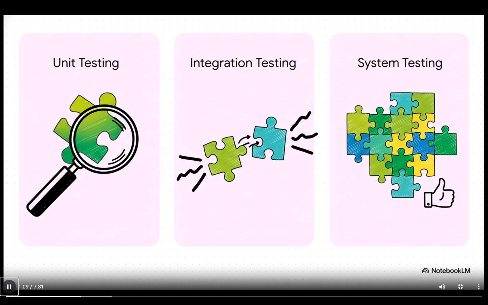
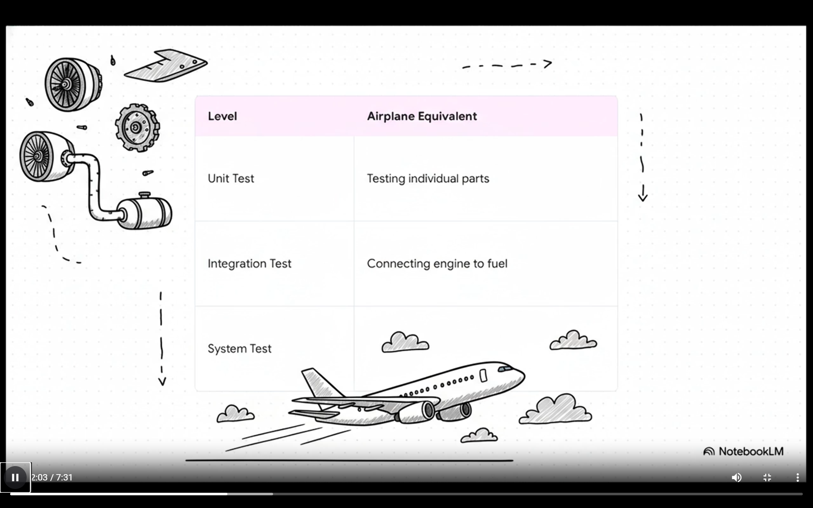
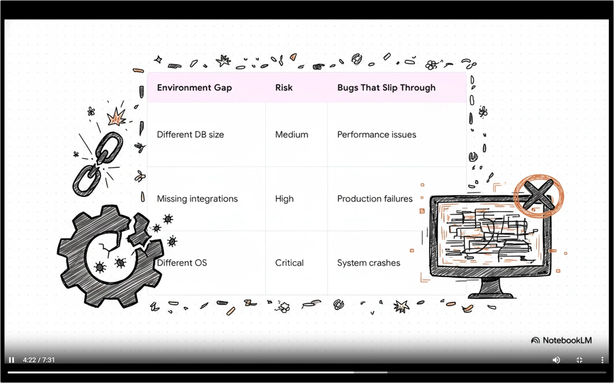
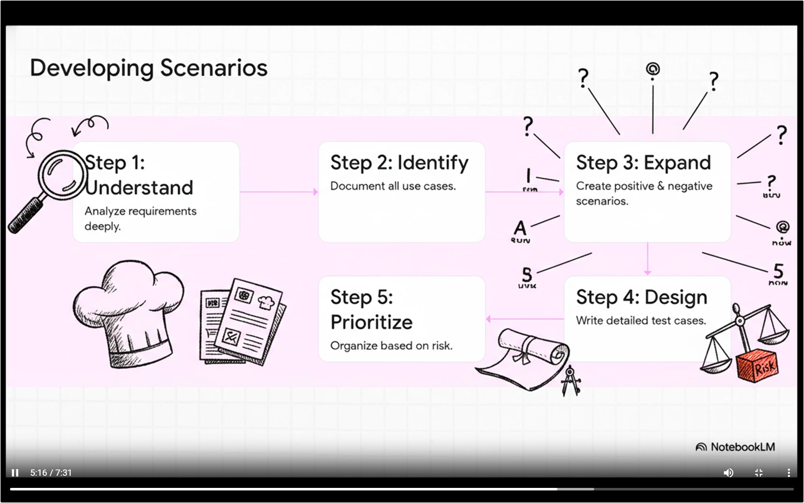

# System Testing

most of the system fails when it is working together not when it is tested in the isolation because the unit tests are stateless and actual environment has memory, so we need to test the entire system once before testing it.

## 3 Pillars
1. Functional Testing - if the features are working well
2. Non-Functional Testing - talks about the quality of features
3. End-to-End Testing - covers the entire user journey from start to end

preparation has to start before even the project starts, in the planning phase

## Entry Criteria
It is the requirements that needs to be met before the testing starts, stops us from testing way too early

> Prepare early test later

## Test Environment
Test environment should be a mirror of the production env; but there is always a huge gap

like the prod might have
 - 3 high capacity servers with 32 gigs of RAM

Test env might have
- 1 old low capacity server with 2 gb of RAM

> don't just test with happy pass you also need to have a it tested for failing test cases

data plays a major role in it, if your data looks clean, you are not testing it right

## How? (Steps)

we can use boundary value analysis to test our systems

## Severity  vs Priority
**Severity** - technical impact -> states how bad the bug is for system

**priority** - business urgency -> how soon do we need to fix the bug

Example of **high severity but low priority**

app crashes to blue screen but only if user enters 1000 character to the name field.

it has high tech impact but we are not delaying launch for it

Example of **low severity but high priority**

logo of the company in the home page is stretched pixelated and is of wrong color

app works, but has high business priority