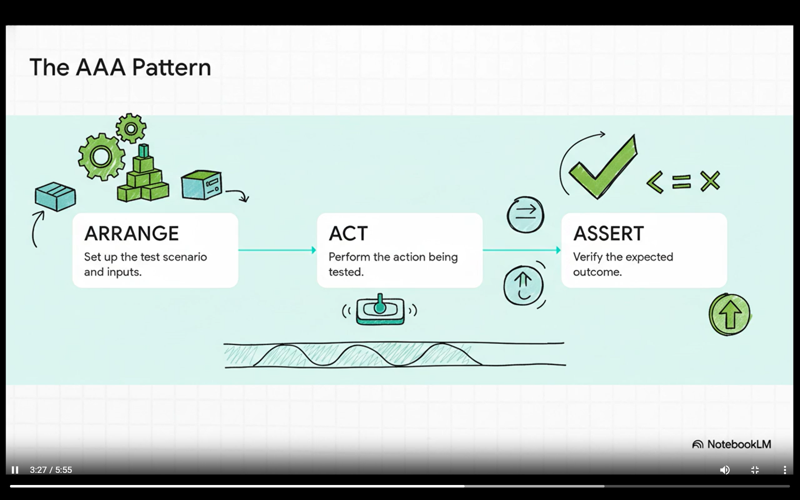

# Unit testing

unit tests are the code that checks other code in the isolation

## Dependency injection
dependency injection means that the internal components like db and other core components are not tighly coupled

> **Dependency Injection means giving a class its dependencies from the outside instead of creating them inside**

test cases are the live documentation for the codebase because the wikis or comments may not be maintained but the test cases are if a test cases is passing then we can clearly define the behaviour of the given code

## BDD
Business Driven Development
red green light strategy
test cases are designed first, then you create the code to pass them, then you refactor the code for efficiency

**code coverage**

_high coverage_!=_good test case_

every single line is run but what if i didnt verify (so low coverage is bad but high coverage doesnt guarantee a good test case)

**Flaky Tests** -> tests that runs sometimes and fails the other times with no code changes

**A test should be deterministic** pass the dependency from outside by giving a fix dependency to just check the case

when you want to fix a bug create the test that fails the code and then fix it post it you can verify things

